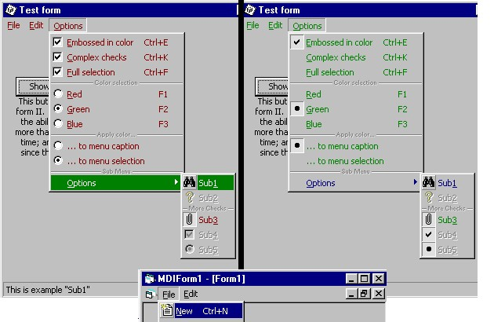



## CoolMenu v1\.2

### Description

See my other submissions to get v1.3  

 

Features: 

-Real Office and Visual Studio like icon menus 

-Disabled pictures in color (optional) 

-Uses the form's font (optional, +size, +color) 

-Working "local" and "global" shortcuts (&; Ctrl+?, etc.) 

-Easy interfacing between ImageList and VB's Menu Editor 

-Event on selection of menu items for context help 

-2 ways to display check marks and/or radio buttons 

-Full selection of item (bar) or text sel. (text color) 

-IE4 hover effect on main menu bar items 

-Tested in MDI environement 

-Subclass more than one form 

-Over 2000 lines (documented) to modify and play with 

-Most complete icon menu project ever seen in VB 

 

Based on Paul DiLascia's work from the Microsoft System Journal

Ported from VC++ to VB by me + some adaptation. visit www.dilascia.com
 
### More Info
 

             |
---                |---
**Submitted On**   |2000-06-09 22:57:34
**By**             |[Olivier Martin](https://github.com/Planet-Source-Code/PSCIndex/blob/master/ByAuthor/olivier-martin.md)
**Level**          |Advanced
**User Rating**    |4.9 (239 globes from 49 users)
**Compatibility**  |VB 5\.0, VB 6\.0
**Category**       |[Custom Controls/ Forms/  Menus](https://github.com/Planet-Source-Code/PSCIndex/blob/master/ByCategory/custom-controls-forms-menus__1-4.md)
**World**          |[Visual Basic](https://github.com/Planet-Source-Code/PSCIndex/blob/master/ByWorld/visual-basic.md)
**Archive File**   |[CODE\_UPLOAD66196102000\.zip](https://github.com/Planet-Source-Code/olivier-martin-coolmenu-v1-2__1-8808/archive/master.zip)

